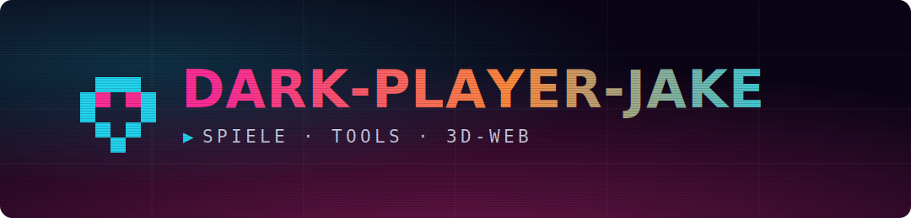
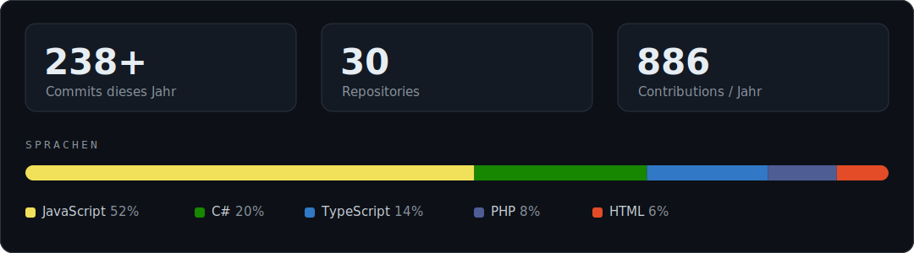
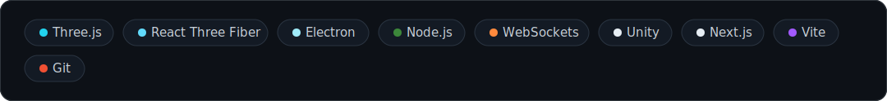

  

## Hi, ich bin Jakob 👋

Ich baue in meiner Freizeit von Grund auf: Browser- und Unity-Games, Desktop-Tools mit Electron und interaktive 3D-Websites. Anspruch: es wird fertig — nicht nur Prototyp.

🚧 **Aktuell dran:** ein 3D-B2B-Konfigurator im Web und ein LAN-Multiplayer-Shooter.

---

### 📊 Auf einen Blick

  

### 🛠 Ausgewählte Projekte

| Projekt | Was es ist | Stack |
| --- | --- | --- |
| **Toolbox** | Zentraler Launcher & Schaltzentrale | Electron |
| **Neon Arena** | Multiplayer-Arena-Shooter (LAN) | Node · WS |
| **Automatenkönig** | Vending-Imperium-Simulator | Unity · C# |
| **bedruckte-tassen** | 3D-B2B-Konfigurator | Next.js · R3F |

### 🧰 Tech-Stack

  

▶ Weiter unten: mein Contribution-Graph &amp; gepinnte Repos.
